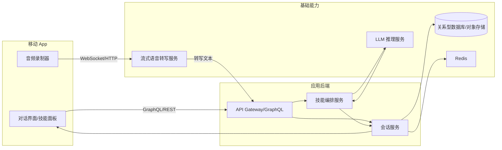

# 技术方案：会议快照 MVP

## 1. 概述
会议快照 MVP 提供移动端实时录音转写、自动纪要、一键 AI 技能以及统一对话体验。第一阶段目标是**复刻参考 App 的前端布局与交互**（顶部录音面板、双标签页、技能按钮区），在保持视觉与操作路径一致的前提下完成底层能力接入。整体方案采用前端 App + 后端微服务的结构，核心能力通过流式音频转写服务、LLM 推理服务与会话数据存储协同实现。

## 2. 系统架构


## 3. 技术选型
- **客户端**：React Native + Expo（便于快速迭代，支持 iOS/Android），集成 WebRTC/MediaRecorder 提供音频采集；UI 采用 Tailwind RN 或 Styled Components 定制实现参考 App 的深色主题、标签页与技能按钮样式。
- **API 网关**：GraphQL（Apollo Server）或 Restify，统一聚合会话查询与写入，便于前端按需取数。
- **会话服务**：Node.js（NestJS）实现，负责转录片段落库、对话消息流式推送与历史会话查询。
- **技能编排**：基于 NestJS 独立模块，封装 Prompt 模板、上下文聚合和对 LLM 的调用。
- **数据存储**：PostgreSQL（结构化会话、消息），S3 兼容对象存储（原始音频/录音片段）。
- **缓存**：Redis（会话上下文缓存、转写片段队列）。
- **转写服务**：第三方流式 STT（豆包大模型（支持说话人识别有限），支持 2 分钟切片与低延迟返回。
- **LLM 服务**：QWEN开源模型，支持流式输出与函数调用。

## 4. 模块设计
### 4.1 会话服务
- **职责**：管理会话生命周期、消息读写、转写片段存储、推送通知。
- **接口**：
  - `POST /sessions/{id}/transcripts`：保存转写片段。
  - `POST /sessions/{id}/messages`：保存 AI/用户消息。
  - `GET /sessions/{id}`：加载会话详情（含转写与 AI 输出）。
- **核心逻辑**：
  1. 接收 STT 回调，写入 `transcript_segments` 表。
  2. 触发纪要生成任务并在完成后写入 `messages` 表。
  3. 使用 Redis 发布订阅或 WebSocket 将新消息推送给客户端。

### 4.2 技能编排服务
- **职责**：统一管理“内心 OS”“头脑风暴”“总结重点”“行动项梳理”等技能。
- **流程**：
  1. 汇总会话内最近一段时间或全量的转写文本（根据技能配置）。
  2. 生成 Prompt，附带技能名称、时间范围。
  3. 调用 LLM，监控 5~10 秒 SLA。
  4. 将结构化结果写入 `messages` 表并回推给客户端。
- **扩展性**：技能通过配置驱动（Prompt 模板 + 上下文范围 + 输出解析规则）。
- **技能要点**：
  - *内心 OS*：基于最近 2 分钟转写与角色信息生成情绪洞察，输出 2-3 条主观解读。
  - *头脑风暴*：合并最近 5 分钟对话与会话累计要点，生成 3+ 条创意或行动思路，并带来源引用。

### 4.3 转写处理流程
1. 客户端每 2 分钟上传音频片段到 STT。
2. STT 异步回调文本到后端 Webhook。
3. 后端校验会话状态 → 写入 `transcript_segments`。
4. 推送实时更新给客户端。
5. 按策略触发纪要技能：汇总最近 `N` 个片段 → 调用 LLM → 写入消息。

### 4.4 对话流与前端复刻
- 恢复参考 App 结构：顶部波形录音卡、底部 TabBar，“实时转写”“AI 总结”标签使用相同排版与字体。
- 客户端维护消息列表，支持 `AI_REPLY`、`SUMMARY_CARD`、`USER_MESSAGE`、`SKILL_RESULT` 等类型，对应不同的卡片样式（含按钮、引用标记）。
- Tab 行为：实时转写页按时间戳自动滚动；AI 总结页展示纪要卡片，支持刷新按钮。
- 接收服务器推送的流式响应，通过 SSE/WebSocket 实现边生成边展示；静态文字区按参考 App 使用米黄色背景与圆角。
- 支持“追问”操作：用户点击某条 AI 回复后发起引用式提问；技能按钮区固定在底部。

## 5. 数据模型
```text
sessions
  id (uuid)
  title
  status (active/ended)
  created_at, updated_at

transcript_segments
  id (uuid)
  session_id -> sessions.id
  start_time, end_time
  speaker_label
  content (text)
  created_at

messages
  id (uuid)
  session_id -> sessions.id
  role (user/ai/system)
  type (transcript_summary/skill_result/user_input)
  content (jsonb)  # 包含文本、要点数组、引用片段ID等
  metadata (jsonb) # 技能名称、上下文范围、耗时
  created_at
```

## 6. 接口与交互
- **订阅**：客户端通过 WebSocket 订阅 `session:{id}` 频道，获取新消息/纪要。
- **查询**：`GET /sessions/{id}?include=messages,transcripts` 支持分页加载历史。
- **技能触发**：`POST /sessions/{id}/skills/{skillType}`，请求体包含当前会话上下文哈希，用于幂等性控制。
- **错误处理**：当 STT/LLM 超时，写入状态消息提示失败并允许用户重试。

## 7. 测试策略
- **单元测试**：对技能 Prompt 构造、消息存储、转写处理进行 Jest 覆盖。
- **集成测试**：mock STT/LLM，验证端到端流程（上传片段 → 生成纪要 → 对话推送）。
- **端到端测试**：使用 Detox/Appium 模拟用户加入会话、触发技能、查看历史消息。
- **性能测试**：压测技能编排接口，确保 5 秒 SLA；测试并发会话数对 Redis/数据库的影响。

## 8. 安全与隐私
- 所有接口使用 HTTPS；访问需要 OAuth2/JWT 鉴权。
- 转写与纪要数据加密存储；敏感字段按需脱敏。
- 明确数据保留策略（如 30 天）并提供删除能力。
- 审计日志记录技能触发、LLM 调用与数据访问操作。

## 9. 未来演进
- 升级“基础会话存储”为长期向量记忆服务，支撑语义检索。
- 引入多模态能力（上传文档、图片）扩展会议材料处理。
- 结合实时协同编辑，为纪要添加人工校正。
